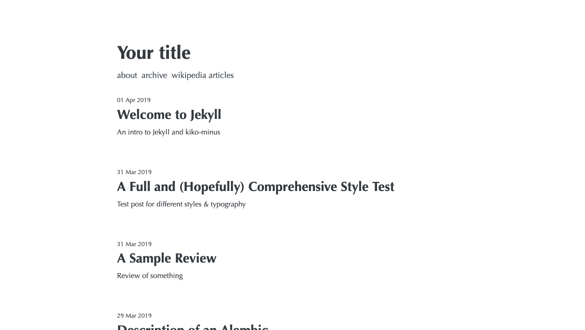

# kiko-minus

[](https://badge.fury.io/rb/kiko-minus)

kiko-minus is a minimalistic Jekyll theme based on [kiko-plus](https://github.com/aweekj/Kiko-plus).

While the design and styles are largely inherited from the original theme, kiko-minus strips away heavy dependencies like Google Analytics and Disqus in favor of lightweight alternatives. It comes with many additional features with an emphasis on privacy and speed, including automatically compressed images, gzip compression, and SEO optimization.

[Demo](https://areebk.gitlab.io/kiko-minus/)

*Warning*: Because Github Pages only supports a limited subset of gems, this theme doesn't work out of the box if you're hosting with Github. Check [this](https://github.com/ask616/kiko-minus-gh) fork that removes the automatic image compression, tag/collection pagination, and archive page so that the theme will work on Github Pages. Until https://github.com/github/pages-gem/issues/257 is resolved, I'll have to maintain two separate repos. If you're using Gitlab pages, this theme should work completely out of the box.



## Features
- Ready for use with GitLab or GitHub pages
- Syntax highlighting
- Automatic image compression
- Zopfli compression (gzip)
- Fully responsive
- Automatic sitemap generation
- Filtered pagination based on tags & collections
- Private comments with [ISSO](https://posativ.org/isso/)
- Analytics with [Fathom](https://usefathom.com/)
- Automatic Atom feed
- No JavaScript, third party requests, or cookies (unless using Fathom or ISSO)
- Structured data support (TODO)

## Installation
You can use kiko-minus on your site after scaffolding with `jekyll new`:

Add this line to your Jekyll site's `Gemfile`:

```ruby
gem "kiko-minus"
```

Copy this [configuration](https://github.com/ask616/kiko-minus/blob/master/_config.yml) to your site's `_config.yml`.

And then execute:

    $ bundle

Or install it yourself as:

    $ gem install kiko-minus

Finally, make sure to follow the directions [below](https://github.com/ask616/kiko-minus#pagination) to enable pagination on your home page.

You can refer to [this](https://gitlab.com/areebk/blog) example for guidance.

### Updating
To update your blog to the latest version of the theme, simply run `bundle update`, or specify the version of kiko-minus you want in your Gemfile, and run `bundle update`.

## Contents
kiko-minus has an assortment of components to minimize additional needed configuration, so that all you need to do is add your posts to `_posts/` and be ready to go.

### `_layouts/`
* `default.html` defines the basic structure of every page, including SEO tags, stylesheet imports, and favicons.
* `home.html` is used for the index page, and includes a navigation bar and the paginated list of all posts.
* `page.html` is used for individual pages i.e. an About or Contact page.
* `post.html` is for your blog posts, and can include a comment section if ISSO is enabled.
* `filtered-home.html` is meant to be used for filtered post lists i.e. pages listing all posts belonging to a category or tag. The sample [wikipedia](https://github.com/ask616/kiko-minus/blob/master/categories/wikipedia.md) page is an example use case to show all posts that are Wikipedia articles.
* `archive.html` shows a condensed view of many posts and their publishing dates.

### `_includes/`
* `footer.html` is put at the bottom of every page to show copyright information.
* `post-list.html` renders out a list of posts as defined by pagination.
* `isso.html` contains the ISSO script tag and is included if comments are enabled. The tag also includes many of the configurable options as defined [here](https://posativ.org/isso/docs/configuration/client/).
* `fathom.html` contains the tracker code and is included if analytics are enabled. The tag requires the address of your server and the site ID as provided by your Fathom instance.

### `_sass/`
`kiko-minus.scss` defines the main variables to be used in the rest of the styles, as well as a couple mixins to help make the site responsive. It also imports the rest of the partials.

Inside `kiko-minus/`:
* `_colors.scss` is copied from [Open color](https://yeun.github.io/open-color/) and defines a broad palette for easy use.
* `_layout.scss` defines the overall structure of the site.
* `_normalize.scss` is copied from [Normalize.css](https://necolas.github.io/normalize.css/) and is used to render the site consistently across all browsers.
* `_syntax-highlighting.scss` defines how code is highlighted.
* `_typography.scss` defines the look and feel of the elements on the site.

### `assets/`
* `css/` contains a single `style.scss` file that imports the rest of the base kiko-minus styles. This is also where custom stylesheets can go, as explained [below](https://github.com/ask616/kiko-minus#custom-stylesheets).
* `img/` is where your images will go for use throughout the site. You can add subfolders here as is done in this sample to better organize. Be warned that the photos here will be optimized *in place*, and that the originals will be copied over to `assets/img_archive` (or as otherwise defined in your config), which isn't included in your website's build.

### Misc
* `.image-optim-cache` is used by the image optimization [plugin](https://github.com/ask616/jekyll-image-optim) to keep track of what files have already been optimized. *Do not delete this!*
* `categories/` and `tags/` can be used to define category or tag filtered pages.
* `pages/` can be used for individual pages.
* `index.md` is the home page for your site.

## Usage

### Pagination
On your `index.md` and any other post list pages that you want paginated (such as category and tag pages), you'll need to add some configuration to each page's front matter. At the very least, you will need the following:

```
pagination:
  enabled: true
```

For more configuration options, you can read the plugin's [docs](https://github.com/sverrirs/jekyll-paginate-v2/blob/master/README-GENERATOR.md#site-configuration).

### Custom Stylesheets
To add your own stylesheet, uncomment the `css` entry in `_config.yml`, and add the location of the stylesheet as its `src`.

### ISSO Integration
To enable comments on your posts, set `isso.enabled` to `true` in your `_config.yml`, and add the location of the embed script as hosted by your ISSO server to `isso.script_src`. The other options can be deleted if you want the defaults as defined on ISSO's [website](https://posativ.org/isso/docs/configuration/client/).

### Fathom Integration
To enable analytics throughout the site, set `fathom.enabled` to `true` in your `_config.yml`, and add the location of the tracker script (i.e. https://yoursite.tld/analytics/tracker.js) to `fathom.script_src` and your site ID to `fathom.site_id`.

If you don't know the location of the script and site ID, you can look at the tracking code provided on your Fathom dashboard:

```
...
  m.parentNode.insertBefore(o,m)
})(document, window, '//mysite.dev/analytics/tracker.js', 'fathom');
fathom('set', 'siteId', 'ABCDE');
fathom('trackPageview');
...

```

In this case, the script is hosted at https://mysite.dev/analytics/tracker.js, and its site ID is ABCDE.

### Gzip Compression
If configured, kiko-minus will automatically create gzipped versions of your text files that will be served by default if GitHub or GitLab pages, or if otherwise configured on your host. As explained in the plugin's [usage](https://github.com/philnash/jekyll-zopfli#usage), the site must be built in production mode to create the gzipped bundles by setting the `JEKYLL_ENV` environment variable as such:

```
JEKYLL_ENV=production bundle exec jekyll build
```

This is done because creating the bundles can be slow, and so should only be done in production mode.

### Category and Tag Pages
The plugin [jekyll-paginate-v2](https://github.com/sverrirs/jekyll-paginate-v2/) lets us paginate on categories and tags (and much more!). The directions for enabling pagination can be found in their [docs](https://github.com/sverrirs/jekyll-paginate-v2/blob/master/README-GENERATOR.md#paginate-categories-tags-locales), and an example is provided here with [wikipedia articles](https://github.com/ask616/kiko-minus/blob/master/categories/wikipedia.md) page. It is _highly_ recommended that you use the `filtered-home` layout for these pages.

### Favicons
kiko-minus supports including a 16x16 and 32x32 px favicon for your site. Place them in the `assets/img/logos/` directory with the names `favicon-16x16.png` and `favicon-32x32.png`, respectively, and they'll automatically be loaded.

### SEO Setup
This theme uses `jekyll-seo-tag` to help provide metadata to improve your SEO scores. You can supply information to the `_config.yml` as defined [here](https://github.com/jekyll/jekyll-seo-tag/blob/master/docs/usage.md) (many of the options are already added to the config you copy over from this theme).

## Contributing

Bug reports and pull requests are welcome on GitHub at https://github.com/ask616/kiko-minus/issues. This project is intended to be a safe, welcoming space for collaboration, and contributors are expected to adhere to the [Contributor Covenant](http://contributor-covenant.org) code of conduct.

## Development

To set up your environment to develop this theme, run `bundle install`.

Your theme is setup just like a normal Jekyll site! To test your theme, run `bundle exec jekyll serve` and open your browser at `http://localhost:4000`. This starts a Jekyll server using your theme. Add pages, documents, data, etc. like normal to test your theme's contents. As you make modifications to your theme and to your content, your site will regenerate and you should see the changes in the browser after a refresh, just like normal.

When your theme is released, only the files in `_layouts`, `_includes`, `_sass` and `assets/css` tracked with Git will be bundled.
To add a custom directory to your theme-gem, please edit the regexp in `kiko-minus.gemspec` accordingly.

## License

The theme is available as open source under the terms of the [MIT License](https://opensource.org/licenses/MIT).
